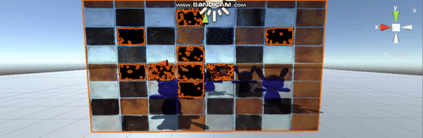
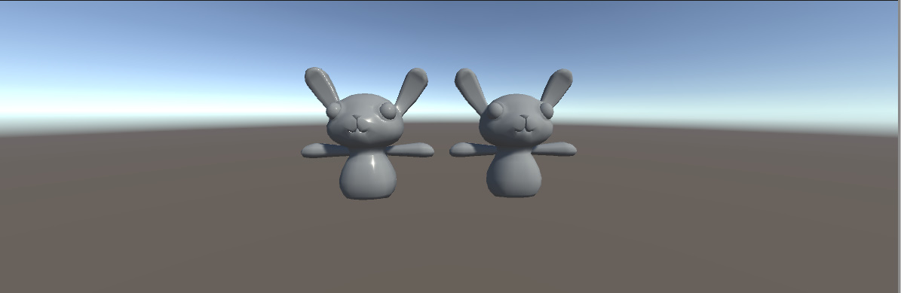
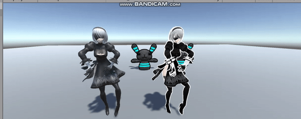
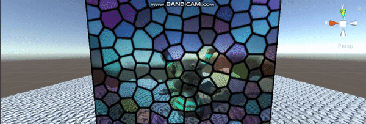
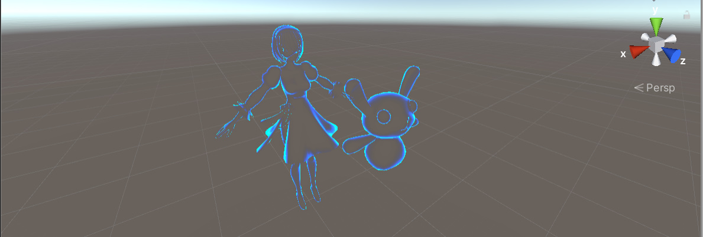
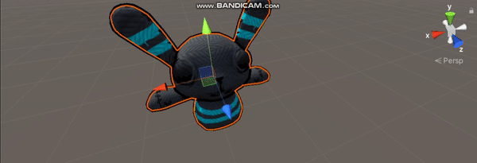
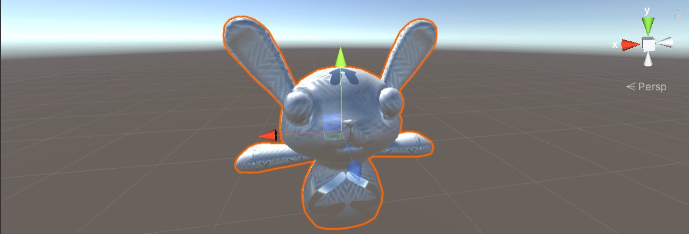
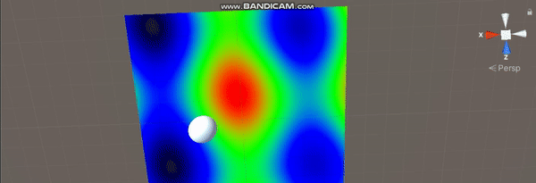
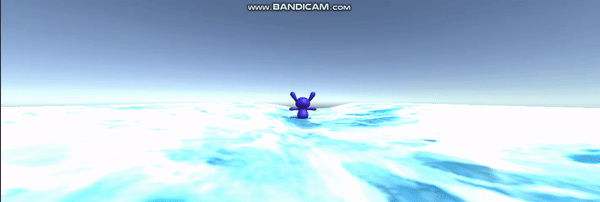

# Unity-shader-examples
Simple shader examples...

# Advanced Stencil

# Alpha Chanel

# Blend two images

# Blend

# Blinn

# Bump Environment

# Standard and toon

# Cloud Noise

# Dot Product

# Glass

# Hologram

# Material Use

# Normal map

# Outline

# Simple PBR

# Plasma

# Ray marching

# Rim light

# Stencil

# Vertex Coloring

# Vertex Extrude

# Vertex Lighting

# Vertex Shading

# Wave

